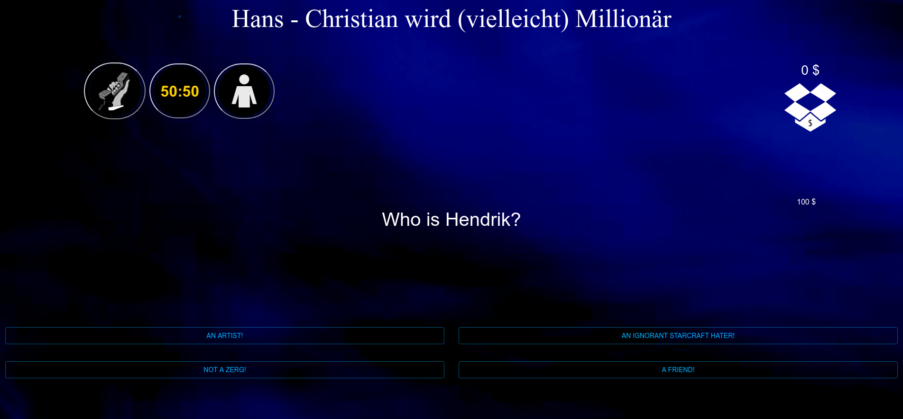

# Wird HCS Millionär?

Installiere Dependencies:

    npm install

Lass den Server Laufen:

    npm run dev

Die Applikation schreibt ein Backup der Applikation. Um die Applikation
neuzustarten muss der gelöscht werden:

    rm state.json
